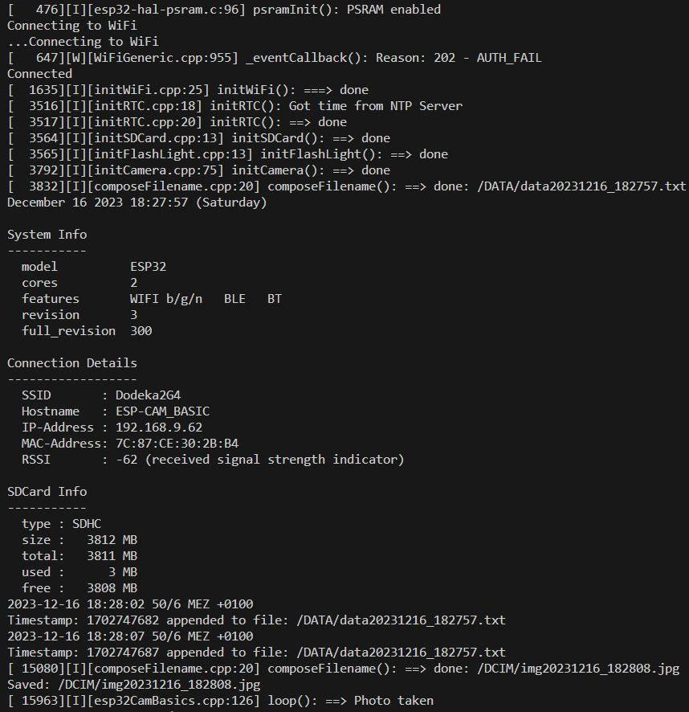

# ESP32-CAM
## Parts
* ESP32-CAM board
* CP2102 UART-USB Converter
* Pushbutton

 

### Test the basic functions of the ESP32-CAM board:
 * Initialize WiFi connection and show connection details
 * Get time information from NTP server and set RTC of the ESP32 with time zone info
 * Initialize SD card and show card info
 * Blink LED_BUILTIN at GPIO_33
 * Flash FLASH_LIGHT at GPIO_4 with set brightness
 * Open a file and periodically write a timestamp
 * Take a phote at a button click and save it to a file on the SD card
 
 ## Wiring
``` 
                      ___________
             .-------|  SD card  |-------.
 FTDI 5V <---o 5V    |  .-----.  |   3V3 o
   .---------o GND   |  |( o )|  |  IO16 o
   |   _T_   o IO12  |  '-cam-'  |   IO0 o---/ to GND for uploading
   '---o o---o IO13  |    ¦ ¦    |   GND o
     Button  o IO15  |____¦ ¦____|   Vcc o 
             o IO14       ¦ ¦        UOR o---> TX  of FTDI
             o IO2        ¦ ¦        UOT o---> RX  of FTDI          
             o IO4        ¦ ¦        GND o---> GND of FTDI
             |        !!!!!!!!!!!        |
             |                           |
             |                 FLASH [x] | 
             |                           |
             |         ESP32-CAM         |
             '---------------------------'
```
## Uploading the code
ESP32-CAM must be programmed with an FTDI-Converter (UART-USB) as follows:
* Connect IO0 to ground
* Compile code, on SUCCESS push reset button on the backside of the ESP32-CAM
* Upload code
* Disconnect IO0 from ground
* Push reset button to run the code

## Terminal output


## Visual effects
* The builtin red led blinks every second for 50 ms
* The builtin white led flashes every 3 seconds for 2 ms

## SD Card
Every 5 seconds the current timestamp retrieved from the RTC is appended to
the file /DATA/dataYYYYMMDD_hhmmss. This function has no higher meaning, but 
only shows how values can be stored continuously in a file.

The photo taken at the click of the push button is stored in the directory /DCIM/.
The filename is composed of the prefix **img** followed by the current date and time in
the form **YYYYMMDD_hhmmss**, e.g. img20230420_173847